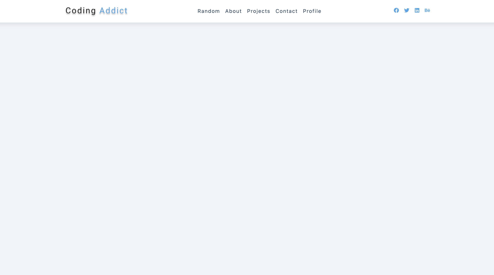
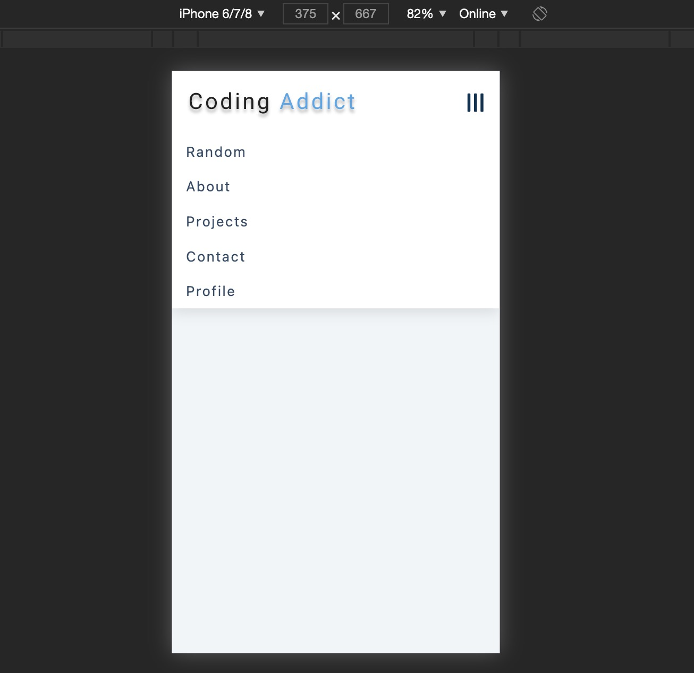

# 项目概览

## 功能

- Nav 导航
  - 适配;
  - phone 端用内容撑开导航高度
    - ref 获取节点, 然后测其节点高度;
- 

---

- 

## react-icon

- https://react-icons.github.io/react-icons
- 用到 react 图标库
  - 用法:

```
npm install react-icons --save
```

```js
import { FaGithubAlt } from "react-icons/fa";

function App() {
  return <FaGithubAlt />;
}
```
