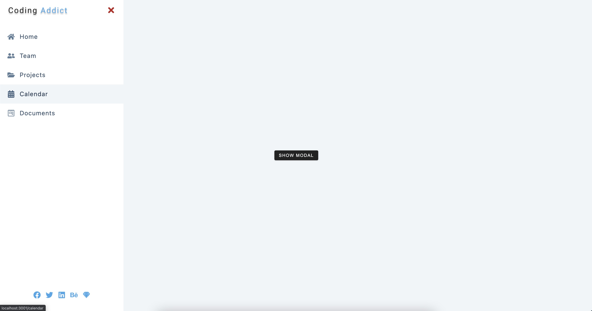

# 项目概览

## 功能

- 侧边nav、普通模块状态通知
  - 用useContext控制组件状态

## react-icon

- https://react-icons.github.io/react-icons
- 用到 react 图标库
  - 用法:

```
npm install react-icons --save
```

```js
import { FaGithubAlt } from "react-icons/fa";

function App() {
  return <FaGithubAlt />;
}
```

- 
