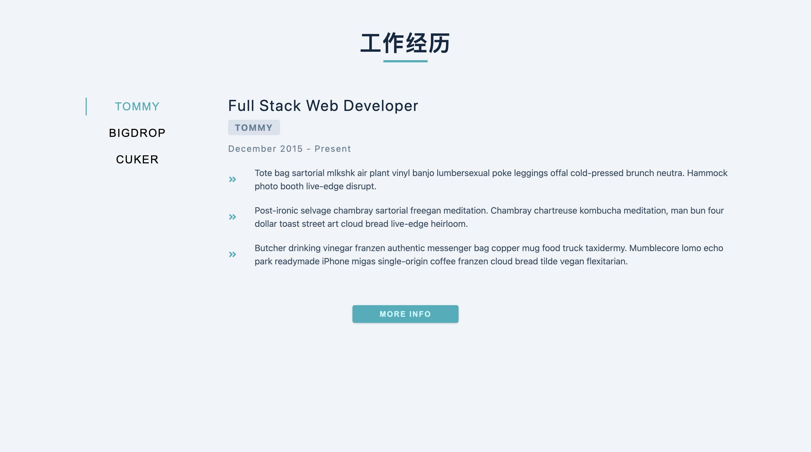

# 项目概览

## 功能

- tab选项卡组件
  - 异步请求数据
  - 图标库使用
  - loading状态管理

## react-icon

- https://react-icons.github.io/react-icons
- 用到 react 图标库
  - 用法:

```
npm install react-icons --save
```

```js
import { FaGithubAlt } from "react-icons/fa";

function App() {
  return <FaGithubAlt />;
}
```

- 
