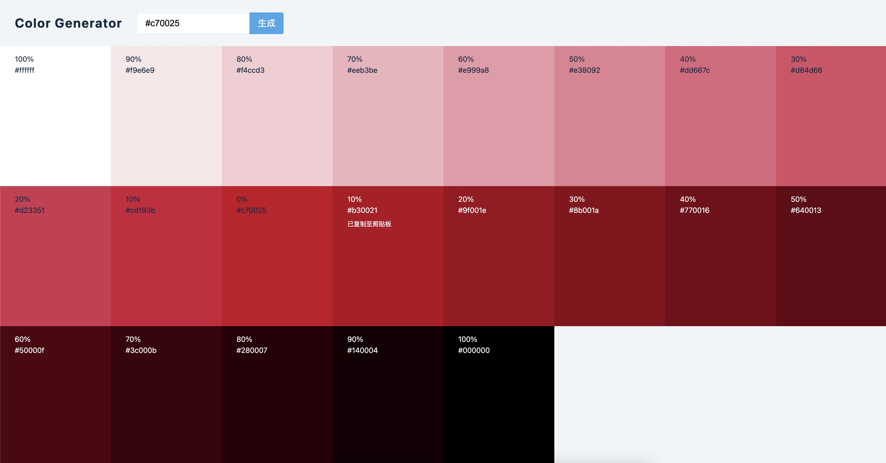

# 项目概览

## 功能

- 颜色生成器
  - 输入#xxxxxx ｜｜ rgb(xxx, xxx, xxx)格式的颜色参数:
    - 生成对应的色系板
- 

## values.js

- https://github.com/noeldelgado/values.js
- 用到 values.js 第三方库
  - 用法:

```
npm install values.js --save
```

```js
import Values from 'values.js'
const color = new Values('hsl(204deg 100% 50% / 1)'), { log } = console

log(color.tint(25))
//> { rgb: [64, 179, 255], alpha: 1, type: "tint", weight: 25, ...methods }
log(color.shade(12))
//> { rgb: [0, 135, 224], alpha: 1, type: "shade", weight: 12, ...methods }
log(color.tints(8))
//> (12) [Values...]
log(color.shades(23))
//> (4) [Values...]
log(color.all(20))
//> (11) [Values...]

// instance example for 'red'
Values {
  alpha: 1
  rgb: (3) [255, 0, 0]
  type: "base"
  weight: 0
  get hex: ƒ(...)
  setColor: ƒ setColor(color)
  tint: ƒ tint(weight=50)
  tints: ƒ tints(weight=10)
  shade: ƒ shade(weight=50)
  shades: ƒ shades(weight=10)
  all: ƒ all(weight=10)
  hexString: ƒ hexString()
  rgbString: ƒ rgbString()
  getBrightness: ƒ getBrightness()
}
```
